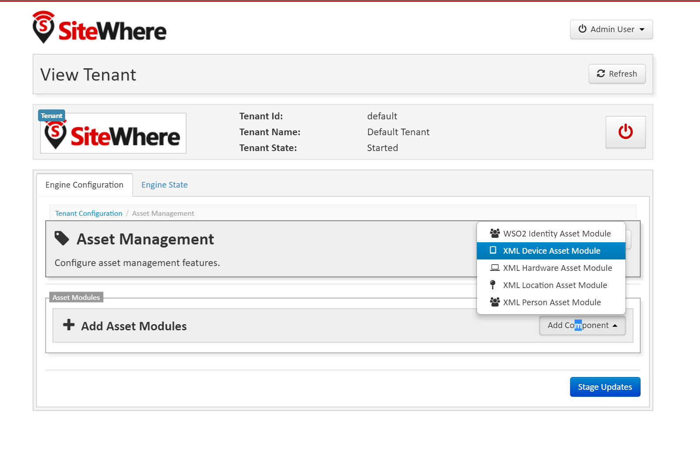
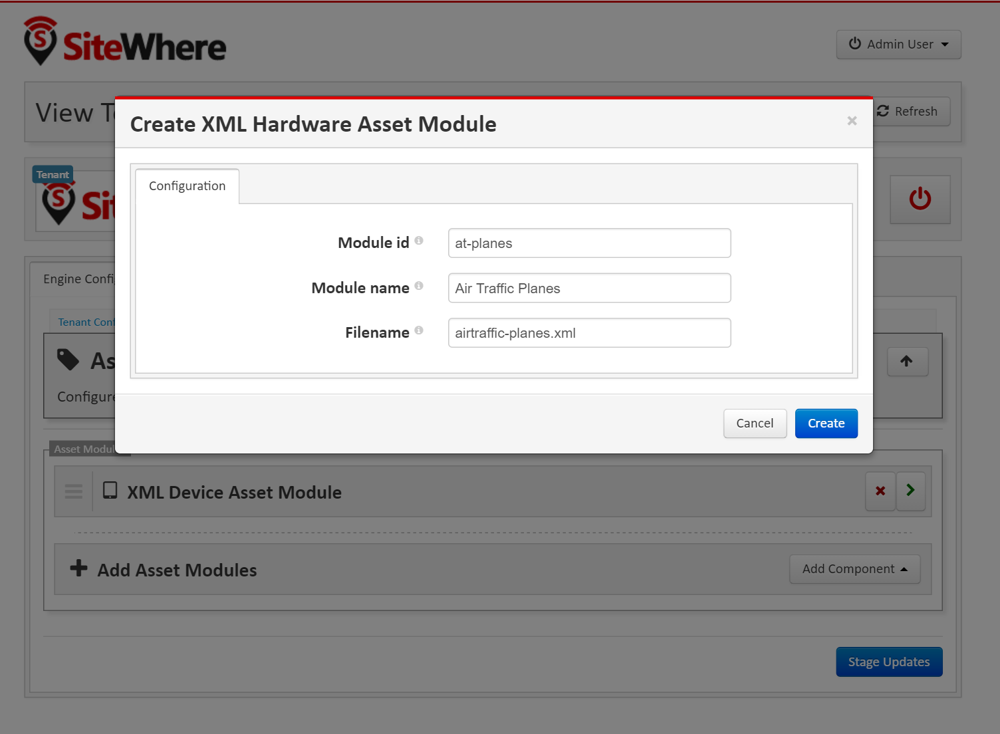
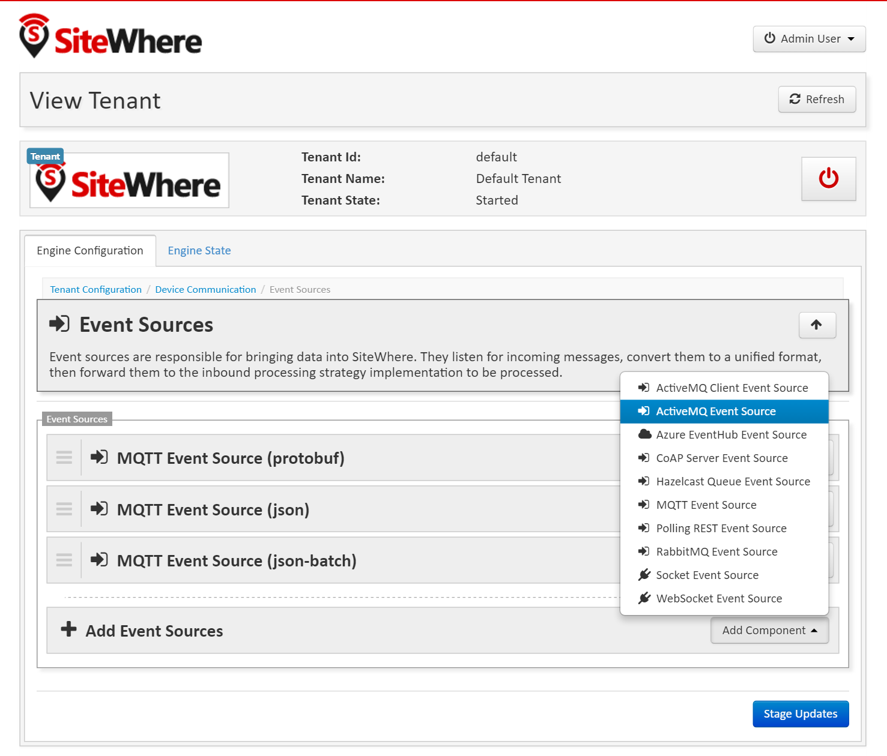
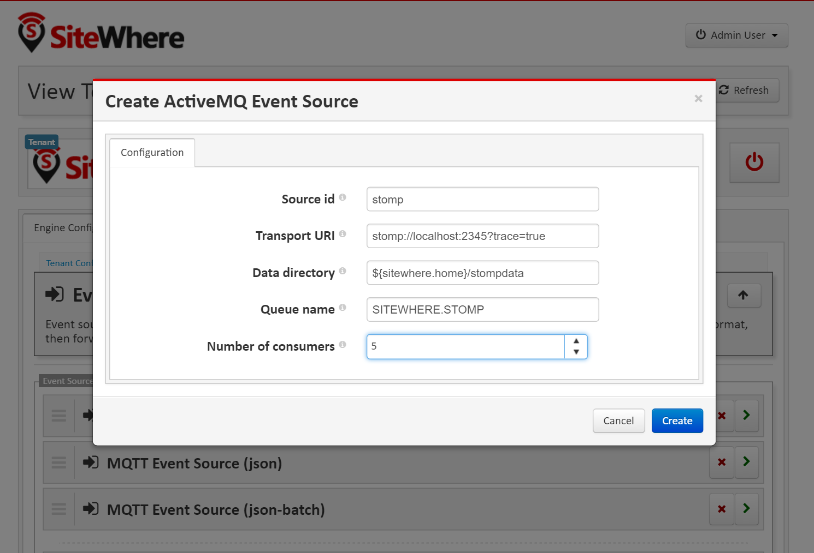
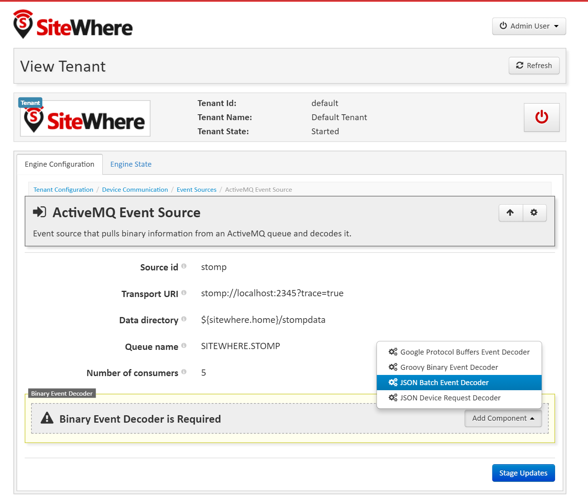

![SiteWhere] (https://s3.amazonaws.com/sitewhere-demo/sitewhere-small.png)

# SiteWhere Air Traffic Control Example
This example project features a web application that displays a map with
many planes being tracked based on simulated data being generated into 
SiteWhere. It shows many key SiteWhere features including the use of device
management and asset managment capabilities via REST services, ingestion
of data via the Stomp protocol, and visualization of data in real-time.

## Set Up SiteWhere
Start by setting up a local or cloud instance of SiteWhere that will
host the devices and other data used by the application. You can download
the latest distribution on the [downloads](http://www.sitewhere.org/downloads/) 
page. Set up the other components such as the database and MQTT broker
as explained in the [installation guide](http://documentation.sitewhere.org/userguide/installation.html).

## Prepare SiteWhere Instance
Before running the example, the SiteWhere instance should be configured with the
assets expected by the air traffic domain as well as an event source to accept
STOMP data from the external application.

### Add Asset Modules
Start by creating a new **assets** folder in the SiteWhere **conf** folder. Copy the
asset XML files from the example project (in the **config/assets** folder) into the
newly created folder in the SiteWhere instance.

Open the tenant configuration editor for the default tenant and choose to **XML Device Asset Module** from
the dropdown.

Fill in the details to point to the XML file copied earlier as shown below:

Next, add an **XML Hardware Asset Module** and fill in the details to point to the XML file
containing plane assets as shown below:

Click the **Stage Updates** button to commit the configuration changes. Stop the tenant engine, then
restart it (using the power button in the banner) to apply the changes.

### Add STOMP Event Source
The air traffic application will be sending data via the STOMP protocol, so the SiteWhere instance
should be configured with a corresponding event source.

Open the tenant configuration editor for the default tenant, choose **Device Communication** > **Event Sources**,
and choose to add a new **ActiveMQ Event Source** as shown below:

Fill in the details for the STOMP event source as shown below:

Navigate into the STOMP event source by clicking on the green arrow beside it, then add a
binary decoder which will parse the incoming STOMP messages. The air traffic application is
using the standard SiteWhere JSON batch format, so choose **JSON Batch Event Decoder** as
shown below:

Click the **Stage Updates** button to commit the configuration changes. Stop the tenant engine, then
restart it (using the power button in the banner) to apply the changes.

The SiteWhere instance is now configured to accept data from the air traffic example.

## Download the Air Traffic Example
Using a Git client, clone the SiteWhere examples project using the command:

> git clone https://github.com/sitewhere/sitewhere-examples.git

The air traffic example is contained in the air-traffic subfolder of the sitewhere-examples
project. The example includes a web application which runs in an embedded Tomcat instance
started by the Gradle build script. When the application runs, it initially looks for a 
SiteWhere instance at the default location (localhost on port 8080) and waits until the
instance is available. Once available, the application creates sample data based on the 
air traffic assets loaded previously.

## Start Air Traffic Example
Navigate to the **air-traffic** folder and execute:

> gradle clean tomcatRun

This example leverages a Gradle plugin which downloads Tomcat, adds the air traffic 
application to it, then runs it as part of the Gradle build. Note that the Gradle 
build will not finish, but rather you will see the application output as it is
deployed on Tomcat.

### Air Traffic Example Boot Process
After SiteWhere is started, the air traffic example application loads its model
via the SiteWhere REST services. It creates device specifications around the tracker
assets and creates device instances for a tracker per plane. It also creates a 
device assignment for each tracker which corresponds to a plane. 

### Real-time Data Generation via Stomp
Once the model has been dynamically loaded, the application starts generating data in real-time
based on the [Stomp](https://stomp.github.io/) protocol. Stomp is a simple connection-oriented
protocol that allows data to be streamed quickly into the system. In this case, SiteWhere
calculates a route for each plane, subdivides it into chunks, and calculates values for each
step of the route. Information simulated includes location, altitude, fuel level, air speed,
and direction. By default, this corresponds to 2 events (location and measurements) for each
plane (x30 planes) per second for a total of 60 events per second.

### Viewing the User Interface
The air traffic example includes a user interface with a map of the United States with plane
icons superimposed to indicate the current position and direction. The color of the plane
icon also indicates the current fuel level -- progressing from green to red as the level 
decreases. The user interface for the example can be accessed from the following URL:

> http://localhost:8090/airtraffic
